<p align="center">
  
</p>

<p align="center">
  
  
  
  
</p>

---

# 📖 Git 命令对照说明书

> *一份颜值与内容并重的 Git 速查手册 —— 像翻电子笔记一样学 Git。*

---

## 🧭 阅读导航

### 📑 完整目录

1. [🗺️ 核心概念速览](#1-核心概念速览) — 三区模型 · 文件生命周期
2. [⚙️ 基础配置篇](#2-基础配置篇) — `config` · `help`
3. [🏗️ 仓库操作篇](#3-仓库操作篇) — `init` · `clone` · `.gitignore`
4. [📸 基本快照篇](#4-基本快照篇) — `add` · `commit` · `status` · `diff` · `restore`
5. [🌿 分支与合并篇](#5-分支与合并篇) — `branch` · `switch` · `merge` · `rebase` · `stash`
6. [☁️ 远程协作篇](#6-远程协作篇) — `remote` · `fetch` · `pull` · `push`
7. [🔍 历史查看篇](#7-历史查看篇) — `log` · `show` · `blame` · `bisect`
8. [🏷️ 标签管理篇](#8-标签管理篇) — `tag`
9. [↩️ 撤销与回退篇](#9-撤销与回退篇) — `reset` · `revert` · `clean` · `reflog`
10. [🚀 高级篇](#10-高级篇) — `submodule` · `worktree` · `archive`
11. [📋 实用工作流](#11-实用工作流) — 日常开发 · Feature分支 · 紧急修复

**附录**：[A. 命令速查表](#附录-a命令速查表) · [B. 推荐别名](#附录-b推荐-git-别名) · [C. 术语中英对照](#附录-c常用术语中英对照)

---

### 🎨 阅读指南

| 读者类型 | 推荐路径 |
|:---|:---|
| 🆕 **零基础新手** | 从头顺序阅读，重点看第 1、2、3、4 章 |
| 📝 **日常使用者** | 直接跳到第 4、5、6 章作为案头速查 |
| 🔧 **遇到问题找方案** | 按目录关键词定位，比如"撤销"→ 第 9 章 |
| 🚀 **进阶提升** | 阅读第 7、10 章和附录 B |

### 📌 图例说明

| 标识 | 含义 |
|:---|:---|
| 🟢 <span style="color:#2da44e">**安全**</span> | 只读或可逆操作，放心使用 |
| 🟡 <span style="color:#bf8700">**注意**</span> | 需理解后再操作，有一定影响 |
| 🔴 <span style="color:#cf222e">**危险**</span> | 不可逆或破坏性操作，谨慎使用 |
| 💡 | 实用技巧 |
| ⚠️ | 重要警告 / 常见陷阱 |
| 🎯 | 命令核心用途 |
| 📐 | 命令公式 / 语法 |
| 🎬 | 使用场景 |

---

## 1. 🗺️ 核心概念速览

### 1.1 Git 的三区模型

> Git 在你的本地维护着**三个逻辑区域**，理解它们是理解一切 Git 命令的关键。

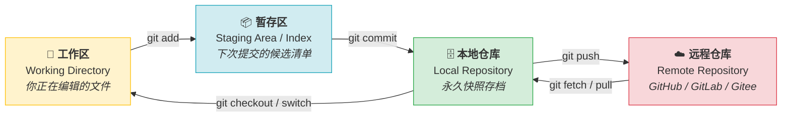

| 区域 | 英文名 | 存放位置 | 作用 |
|:---|:---|:---|:---|
| **工作区** | Working Directory | 你硬盘上的项目文件夹 | 你实际编辑、创建、删除文件的地方 |
| **暂存区** | Staging Area / Index | `.git/index` | 一个"购物车"，决定下次提交包含哪些修改 |
| **本地仓库** | Repository | `.git/objects/` | Git 的永久数据库，存着所有提交的快照 |
| **远程仓库** | Remote | GitHub / GitLab 等服务器上 | 团队共享的中心化副本 |

---

### 1.2 文件生命周期

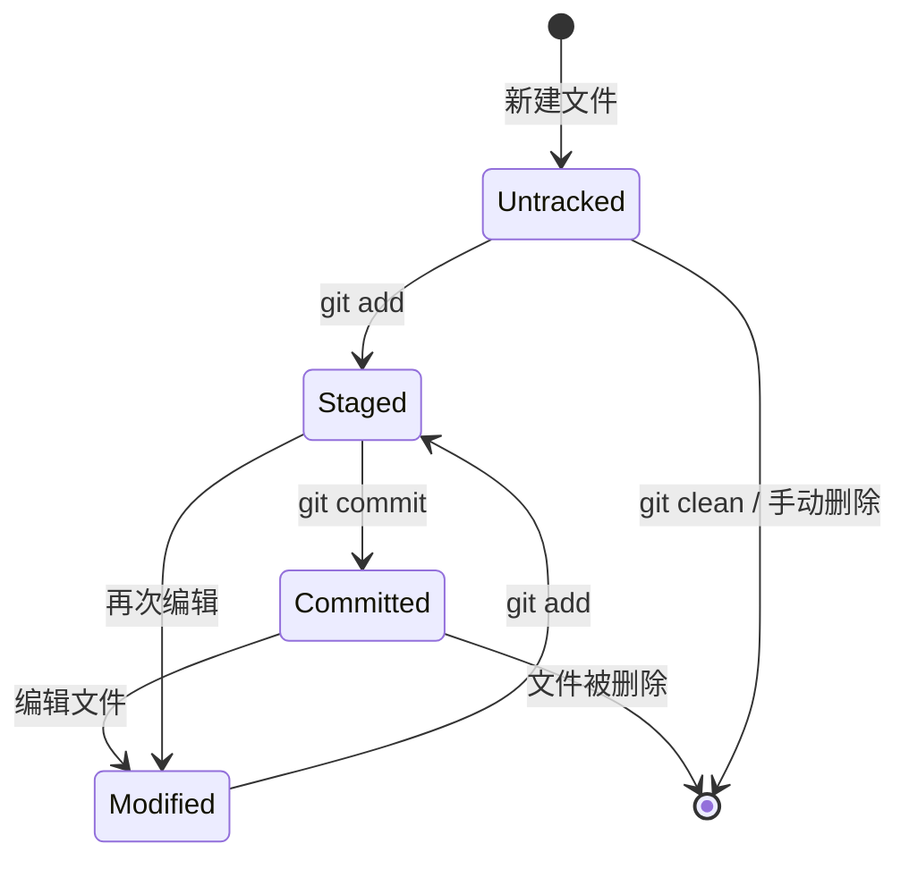

> 💡 **一句话总结**：Git 不跟踪"没 add 过的新文件"。一旦 `git add`，Git 就开始关注它了。

---

### 1.3 Git 的快照哲学

> ⚠️ **关键认知**：Git 与其他版本控制系统（如 SVN）的根本区别在于 —— Git 存储的是**快照（Snapshot）**而非**差异（Delta）**。
>
> 每次 `git commit`，Git 会把你暂存区中的**全部文件拍一张照片**存下来。没变的文件不会重复存储，而是引用上一次的快照（通过 SHA-1 哈希去重）。这让分支、回退、查询都极快。

---

## 2. ⚙️ 基础配置篇

> 🟢 <span style="color:#2da44e">**安全等级：安全**</span> — 配置操作只影响设置，不改变代码。

---

### 🎯 `git config` — 配置 Git 行为


**📐 公式**:
```bash
git config [--global | --system | --local] <key> <value>
git config [--global | --system | --local] --list   # 查看配置
git config [--global | --system | --local] --edit   # 用编辑器打开配置文件
```

**💡 一句话**: 设置 Git 的用户信息、编辑器偏好、别名等个性化参数。

#### 三级配置（优先级从高到低）

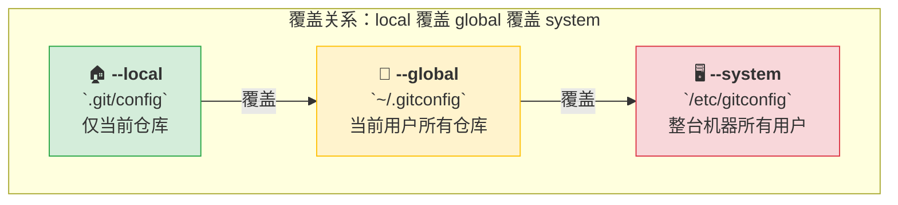

| 🎬 场景 | ⌨️ 命令 | 📝 说明 |
|:---|:---|:---|
| **你是谁？（必做）** | `git config --global user.name "Your Name"` | 你的名字，出现在提交记录中 |
| | `git config --global user.email "you@example.com"` | 你的邮箱，匹配 GitHub 账户 |
| **换默认编辑器** | `git config --global core.editor "code --wait"` | 设为 VS Code（`--wait` 让 Git 等编辑器关闭） |
| | `git config --global core.editor vim` | 设为 Vim |
| **换默认分支名** | `git config --global init.defaultBranch main` | 新仓库默认分支名从 `master` → `main` |
| **换行符处理** | `git config --global core.autocrlf input` | Mac/Linux 用 `input` |
| | `git config --global core.autocrlf true` | Windows 用 `true`（检出转 CRLF，提交转 LF） |
| **设置代理** | `git config --global http.proxy http://127.0.0.1:7890` | 科学上网加速 clone |
| **取消代理** | `git config --global --unset http.proxy` | 恢复直连 |
| **查看所有配置** | `git config --list` | 列出当前生效的全部配置 |
| **查看某一项** | `git config user.name` | 查看当前用户名 |
| **编辑配置文件** | `git config --global --edit` | 用默认编辑器打开 ~/.gitconfig |

#### 🔧 常用别名（强烈推荐）

```bash
# 在 ~/.gitconfig 的 [alias] 段中添加，或者下面这样一键设置：
git config --global alias.co checkout
git config --global alias.br branch
git config --global alias.st status
git config --global alias.lg "log --oneline --graph --decorate --all"
git config --global alias.unstage "restore --staged ."
git config --global alias.last "log -1 HEAD"
git config --global alias.undo "reset --soft HEAD~1"
```

> 💡 设置后 `git st` = `git status`，`git lg` = 漂亮的图形化日志。更多别名见 [附录 B](#附录-b推荐-git-别名)。

---

### 🎯 `git help` — 查看帮助


**📐 公式**:
```bash
git help <command>    # 打开详细的本地 HTML/Man 文档
git <command> --help   # 等同于上面
git <command> -h       # 精简版（只列出常用选项）
```

| 🎬 场景 | ⌨️ 命令 | 📝 说明 |
|:---|:---|:---|
| 详细手册 | `git help log` | 打开 log 命令的完整文档 |
| 快速参考 | `git log -h` | 只显示 log 的常用选项摘要 |

---

## 3. 🏗️ 仓库操作篇

> 🟢 <span style="color:#2da44e">**安全等级：安全**</span> — 创建仓库不影响已有项目。

---

### 🎯 `git init` — 初始化仓库


**📐 公式**:
```bash
git init [directory]            # 在当前（或指定）目录创建 .git
git init --initial-branch=main  # 指定默认分支名
```

**💡 一句话**: 把普通文件夹变成 Git 仓库。

| 🎬 场景 | ⌨️ 命令 | 📝 说明 |
|:---|:---|:---|
| 当前目录初始化 | `git init` | 在当前位置创建 `.git` 隐藏目录 |
| 指定目录初始化 | `git init my-project` | 创建 `my-project/` 并初始化 |
| 指定默认分支 | `git init --initial-branch=main` | 默认分支命名为 main 而非 master |

> 💡 `git init` 只是创建 `.git` 文件夹，**不会自动提交任何东西**。你还需要 `git add` + `git commit`。

---

### 🎯 `git clone` — 克隆仓库


**📐 公式**:
```bash
git clone <url> [directory]           # 克隆到指定目录
git clone --depth <n> <url>           # 浅克隆（只取最近 n 次提交）
git clone --branch <name> <url>       # 只克隆指定分支
git clone --single-branch <url>       # 只下载一个分支的历史
```

**💡 一句话**: 把远程仓库完整（或按需）下载到本地。

| 🎬 场景 | ⌨️ 命令 | 📝 说明 |
|:---|:---|:---|
| **标准克隆** | `git clone https://github.com/user/repo.git` | 完整克隆，默认分支为 main/master |
| 克隆到指定文件夹 | `git clone <url> my-folder` | 不叫 repo 原名，叫 my-folder |
| **浅克隆（提速）** | `git clone --depth 1 <url>` | 只拉最近 1 次提交，大仓库秒下 |
| 深度浅克隆 | `git clone --depth 10 <url>` | 拉最近 10 次提交 |
| 克隆指定分支 | `git clone -b develop <url>` | 克隆后直接切到 develop 分支 |
| 只克隆一个分支 | `git clone --single-branch -b main <url>` | 节省空间，只下载 main 分支 |

> ⚠️ **注意**：浅克隆（`--depth 1`）下载飞快，但本地没有完整历史，后续 `git log` 只能看到浅层记录。如需完整历史，用 `git fetch --unshallow` 补全。

---

### `.gitignore` — 忽略文件规则


**📐 公式**: 在仓库根目录创建 `.gitignore` 文件，每行一条规则。

**💡 一句话**: 告诉 Git 哪些文件和文件夹不要跟踪（日志、依赖包、编译产物、密钥等）。

#### 语法规则速查

| 规则 | 含义 | 示例 |
|:---|:---|:---|
| `*.log` | 匹配所有 `.log` 文件 | `error.log`, `debug.log` |
| `node_modules/` | 匹配整个目录 | `node_modules/` 下的所有内容 |
| `/dist` | 只匹配**根目录**下的 dist | `dist/`，不匹配 `src/dist/` |
| `*.txt` 然后 `!important.txt` | 先忽略所有 .txt，再取消忽略 important.txt | `!` 表示例外 |
| `**/temp/` | `**` 匹配任意层级 | `a/temp/`, `a/b/temp/` |
| `*.yml` 但 `*.yaml` 不忽略 | 没有使用 `!`，所以 yaml 不被先前的 `*` 规则覆盖 | — |

#### 典型模板（前端/Node 项目）

```bash
# 依赖
node_modules/

# 编译产物
dist/
build/
.out/

# 环境变量（含密钥）
.env
.env.local
.env.*.local

# 编辑器配置
.vscode/
.idea/

# 操作系统
.DS_Store
Thumbs.db

# 日志
*.log
```

> 💡 GitHub 提供了各语言的标准 `.gitignore` 模板：[github.com/github/gitignore](https://github.com/github/gitignore)
>
> ⚠️ `.gitignore` **只对未跟踪的文件生效**。如果文件已经被 `git add` 过了，需要先 `git rm --cached <file>` 移除跟踪。

---

## 4. 📸 基本快照篇

> 🟢 <span style="color:#2da44e">**日常最高频操作区**</span> — add、commit、status、diff、restore 是你每天要用几十次的命令。

---

### 🎯 `git status` — 查看状态


**📐 公式**:
```bash
git status              # 详细模式（带提示）
git status -s           # 简短模式
git status -sb          # 简短模式 + 当前分支信息
```

**💡 一句话**: 告诉你"谁改了、谁没跟踪、谁准备好了"，是使用频率最高的命令。

#### 解读 `-s` 简短模式的标志位

```
XY filename
 ↑↑
 │└─ Y: 暂存区状态
 └── X: 工作区状态
```

| 标志 | 含义 |
|:---|:---|
| `??` | ❓ Untracked — 新文件，未被 Git 跟踪 |
| `A ` | ✅ Added — 新文件已暂存（绿色） |
| `M ` | 📝 Staged — 修改已暂存（绿色，在暂存区） |
| ` M` | 📝 Modified — 修改了但未暂存（红色，仅在工作区） |
| `D ` | 🗑️ Deleted — 删除操作已暂存（绿色） |
| ` D` | 🗑️ 删除了文件但未暂存（红色） |
| `MM` | 🔄 部分修改暂存，之后又改了 — 两边都有修改 |
| `R ` | ✏️ Renamed — 重命名已暂存（绿色） |

| 🎬 场景 | ⌨️ 命令 | 📝 说明 |
|:---|:---|:---|
| 详细状态 | `git status` | 最常用，Git 甚至会告诉你下一步可以做什么 |
| 一行一个文件 | `git status -s` | 适合脚本处理，或快速扫一眼 |
| 含分支信息 | `git status -sb` | 短格式 + `## main...origin/main` |

> 💡 **最实用的提示**：`git status` 的输出里，Git 自己会告诉你"下一步怎么撤销"——仔细看！

---

### 🎯 `git add` — 暂存变更


**📐 公式**:
```bash
git add <file> ...      # 暂存指定文件
git add .               # 暂存当前目录及子目录的所有变更
git add -A              # 暂存整个仓库的所有变更（删除/新增/修改）
git add -p              # 交互式分块暂存（非常实用！）
git add -i              # 交互式菜单模式
git add -u              # 只暂存已跟踪文件的修改和删除（不包含新文件）
```

**💡 一句话**: 把工作区的修改加到"购物车"（暂存区），准备提交。

| 🎬 场景 | ⌨️ 命令 | 📝 说明 |
|:---|:---|:---|
| 暂存一个文件 | `git add README.md` | 把 README 加入暂存区 |
| 暂存多个文件 | `git add file1.ts file2.ts` | 空格分隔即可 |
| **暂存所有变更** | `git add .` | 最常用！当前目录下的新增+修改+删除 |
| **分块暂存（推荐！）** | `git add -p` | 逐块(hunk)让你确认，s=暂存 n=跳过 q=退出 |
| 只暂存已跟踪文件 | `git add -u` | 修改和删除，不含新增的 untracked 文件 |
| 暂存全部（含上层） | `git add -A` | 从仓库根目录开始的所有变更 |
| 交互式菜单 | `git add -i` | 提供菜单让你选要做什么 |

> 💡 `git add -p` 是高级用户的秘密武器。你改了一个文件但只想提交其中一部分改动？`-p` 让你**逐块选择**。每个块可选：`y` 加入、`n` 跳过、`s` 拆分更小块、`e` 手动编辑。

---

### 🎯 `git commit` — 提交快照


**📐 公式**:
```bash
git commit -m "message"              # 最常用：带消息提交
git commit -a -m "message"           # 跳过 add，直接提交所有已跟踪文件的修改
git commit --amend -m "new msg"      # 修改最后一次提交的消息
git commit --amend --no-edit         # 追加遗漏的文件到上一次提交（不改消息）
```

**💡 一句话**: 把暂存区的快照永久保存到本地仓库。

| 🎬 场景 | ⌨️ 命令 | 📝 说明 |
|:---|:---|:---|
| **标准提交** | `git commit -m "feat: add login page"` | 只提交暂存区里的内容 |
| **跳过暂存直接提交** | `git commit -a -m "fix: typo"` | ⚠️ 只对**已跟踪**文件的修改生效，新文件仍需 add |
| **补充遗漏文件** | `git commit --amend --no-edit` | 把忘掉的文件补进上次提交里，不改消息 |
| **改提交消息** | `git commit --amend -m "better message"` | 修改上一次提交的消息 |
| 打开编辑器写详细消息 | `git commit` | 不带 -m，打开编辑器写标题+正文 |

#### 📝 提交信息规范（Conventional Commits）

```bash
<type>(<scope>): <subject>          # 标题（50 字以内，英文）

<body>                              # 正文（72 字换行，解释为什么改）

<footer>                            # 脚注（关联 issue 等）
```

| Type | 含义 | 示例 |
|:---|:---|:---|
| `feat` | 新功能 | `feat(auth): add login page` |
| `fix` | 修 Bug | `fix(api): handle null response` |
| `docs` | 文档 | `docs: update README` |
| `style` | 格式（空格、分号等） | `style: format with prettier` |
| `refactor` | 重构（不改变功能） | `refactor: extract helper function` |
| `perf` | 性能优化 | `perf: use memoization in list` |
| `test` | 测试 | `test: add unit test for login` |
| `chore` | 杂项 | `chore: update dependencies` |

> ⚠️ **关键理解**：`git commit` 只提交**暂存区**的内容。工作区里的修改如果没 `git add`，不会进入这次提交。所以 `git status` 查看 → `git add` 挑选 → `git commit` 保存，是标准三步。
>
> ⚠️ `--amend` **不修改历史**，它创建一个新的提交来替换上一次提交。如果已经 push 到远程，**不要 amend**，否则会搞乱协作者的仓库。🚫

---

### 🎯 `git diff` — 查看差异


**📐 公式**:
```bash
git diff                    # 工作区 vs 暂存区（还没 add 的改动）
git diff --staged           # 暂存区 vs 最新提交（已 add 但还没 commit 的）
git diff HEAD               # 工作区 vs 最新提交（所有没提交的改动总和）
git diff <commit1> <commit2>  # 两个提交之间的差异
git diff --name-only        # 只列出改了名的文件（不显示具体内容）
git diff --stat             # 只显示统计：哪些文件改了多少行
```

**💡 一句话**: 看"改了什么"，可以比较任意两个版本。

| 🎬 场景 | ⌨️ 命令 | 📝 说明 |
|:---|:---|:---|
| **我改了啥还没 add？** | `git diff` | 最常用！工作区 ↔ 暂存区 |
| **我 add 了啥准备提交？** | `git diff --staged` | 暂存区 ↔ HEAD，提交前最后确认 |
| **所有未提交的改动** | `git diff HEAD` | 工作区 ↔ HEAD（含暂存+未暂存的总和） |
| 比较两个分支 | `git diff main..feature` | feature 比 main 多了什么 |
| 比较两个提交 | `git diff abc123..def456` | 两个 commit SHA 之间的差异 |
| 只看文件名 | `git diff --name-only HEAD~1` | 上次提交改了哪些文件 |
| 看统计数字 | `git diff --stat HEAD~1` | + 几行 - 几行 |

> 💡 **`git diff` 的输出解读**：
> - `-` 红行为删除的行
> - `+` 绿行为新增的行
> - `@@ -a,b +c,d @@` 表示：旧文件从第 a 行开始共 b 行，新文件从第 c 行开始共 d 行

---

### 🎯 `git restore` — 撤销工作区/暂存区变更


**📐 公式**:
```bash
git restore <file>             # 撤销工作区的修改（用暂存区覆盖工作区）
git restore --staged <file>    # 撤销暂存（从暂存区移除，工作区修改保留）
git restore --source <commit> <file>  # 从指定提交恢复文件
```

**💡 一句话**: Git 2.23+ 的新命令，专门负责"恢复"——比旧命令 `git checkout` 语义更清晰。

| 🎬 场景 | ⌨️ 命令 | 📝 说明 |
|:---|:---|:---|
| **撤销工作区修改** | `git restore <file>` | 丢弃工作区的改动，恢复到暂存区的版本 |
| 撤销所有工作区修改 | `git restore .` | 丢弃当前目录所有改动 |
| **取消暂存 (unstage)** | `git restore --staged <file>` | 从暂存区移除，改动回到工作区 |
| 从历史版本恢复 | `git restore --source HEAD~2 <file>` | 把文件恢复到 2 次提交前的状态 |
| 从其他分支恢复 | `git restore --source main <file>` | 用 main 分支的版本覆盖当前文件 |

> ⚠️ `git restore <file>` **会丢弃工作区的修改，不可恢复**（除非在 reflog 里，但那不是常规手段）。执行前请确认。

#### restore vs checkout vs reset 对比

| 需求 | 新版命令 (Git 2.23+) | 旧命令 |
|:---|:---|:---|
| 撤销工作区某文件 | `git restore <file>` | `git checkout -- <file>` |
| 取消暂存 | `git restore --staged <file>` | `git reset HEAD <file>` |

> 💡 建议从现在开始只用 `git restore`，语义明确不容易误操作。

---

### 🎯 `git rm` / `git mv` — 删除与移动


**📐 公式**:
```bash
git rm <file>              # 删除文件并暂存此删除操作
git rm --cached <file>     # 只从 Git 跟踪中移除，保留本地文件
git mv <old> <new>         # 重命名/移动并自动暂存
```

| 🎬 场景 | ⌨️ 命令 | 📝 说明 |
|:---|:---|:---|
| 删除文件 | `git rm old-file.ts` | 删除文件 + 暂存删除 |
| **停止跟踪但保留文件** | `git rm --cached config.json` | 文件留在硬盘，Git 不再跟踪 |
| 重命名 | `git mv old.ts new.ts` | 等同于 mv + git add，Git 会自动识别为重命名 |
| 移动文件 | `git mv src/file.ts lib/file.ts` | 移动并暂存 |

> 💡 `git rm --cached` 最常见的场景：你把 `node_modules/` 或 `.env` 不小心 commit 了，用它停止跟踪，再加入 `.gitignore`。

---

## 5. 🌿 分支与合并篇

> 🟡 <span style="color:#bf8700">**安全等级：注意**</span> — 分支操作是 Git 的灵魂，也是新手最容易出错的区域。

---

### 🎯 `git branch` — 分支管理


**📐 公式**:
```bash
git branch                    # 列出本地分支
git branch -a                 # 列出所有分支（含远程跟踪分支）
git branch <name>             # 创建分支（但不切换）
git branch -d <name>          # 安全删除（已合并才允许删）
git branch -D <name>          # 强制删除（不管是否合并）
git branch -m <old> <new>     # 重命名分支
git branch -v                 # 显示每个分支的最新提交
git branch --merged           # 列出已合并到当前分支的分支
git branch --no-merged        # 列出未合并的分支
```

**💡 一句话**: 分支是 Git 的"平行宇宙"——在一条分支上工作不影响另一条。

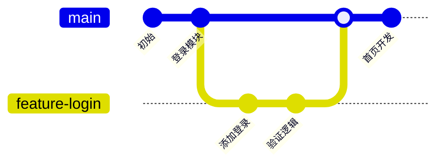

| 🎬 场景 | ⌨️ 命令 | 📝 说明 |
|:---|:---|:---|
| 列出本地分支 | `git branch` | `*` 标记当前分支 |
| 列出所有分支 | `git branch -a` | 含 `remotes/origin/xxx` |
| 创建分支 | `git branch feature-x` | 在当前提交上创建，但不切换过去 |
| **创建+切换** | `git switch -c feature-x` | 👈 推荐用这个，一步到位 |
| 删除已合并分支 | `git branch -d feature-x` | 安全，没合并的分支会拒绝删除 |
| 强制删除 | `git branch -D feature-x` | 🔴 不管有没有合并都删 |
| 重命名 | `git branch -m old-name new-name` | 如果已在新名字上，只需一个参数 `git branch -m new-name` |
| 清理远程已删分支的本地引用 | `git remote prune origin` | 别人删了远程分支，你的本地还有 `origin/xxx` 残留 |

> ⚠️ 用 `-d`（小写）删除更安全。当 Git 警告"未合并"时停下来想想是否真的要删。确定要删再用 `-D`（大写）。

---

### 🎯 `git switch` — 切换分支（推荐）


**📐 公式**:
```bash
git switch <branch>           # 切换到已有分支
git switch -c <new-branch>    # 创建并切换到新分支
git switch -c <new> <base>    # 基于指定分支/提交创建新分支
git switch -                  # 切回上一个分支（类似 cd -）
```

**💡 一句话**: Git 2.23+ 推出的专用切换命令，替代 `git checkout` 的切换功能。

| 🎬 场景 | ⌨️ 命令 | 📝 说明 |
|:---|:---|:---|
| 切换分支 | `git switch main` | 切到 main 分支 |
| **创建并切换** | `git switch -c feature-auth` | 新建 feature-auth 并切过去 |
| 基于远程分支创建 | `git switch -c feature origin/feature` | 基于远程的 origin/feature 创建本地分支 |
| **切回上一个分支** | `git switch -` | 在两个分支间快速跳转 |
| 基于某个提交创建 | `git switch -c hotfix abc123` | 在 abc123 这个提交上创建 hotfix 分支 |

> 💡 **switch vs checkout**：`git checkout` 一个命令干两件事（切换分支 + 恢复文件），容易混淆。Git 2.23+ 把它拆成了 `git switch`（切换分支）和 `git restore`（恢复文件）。新项目请用新命令。

---

### 🎯 `git merge` — 合并分支


**📐 公式**:
```bash
git merge <branch>              # 将指定分支合并到当前分支
git merge --no-ff <branch>      # 禁用快进，总是创建合并提交
git merge --squash <branch>     # 把所有提交压缩成一个再合并（不自动 commit）
git merge --abort               # 合并出问题时放弃，回到合并前状态
```

**💡 一句话**: 把另一个分支上的工作成果"吸收"到当前分支。

#### 两种合并模式图解

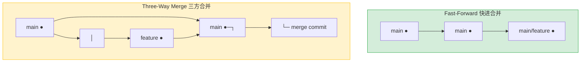

| 🎬 场景 | ⌨️ 命令 | 📝 说明 |
|:---|:---|:---|
| 合并 feature 到当前分支 | `git merge feature` | 把 feature 分支的改动合进来 |
| 保留分支历史 | `git merge --no-ff feature` | 总是创建一个合并提交，方便追溯 |
| 压缩合并 | `git merge --squash feature` | 把 feature 上的一堆提交压缩成一个变更集 |
| **放弃合并** | `git merge --abort` | 冲突太多不想处理了，回到合并前 |

---

#### 🔥 解决合并冲突

冲突发生时，Git 会在文件中标记：

```bash
<<<<<<< HEAD
这是你当前分支（main）的内容
=======
这是要合进来的分支（feature）的内容
>>>>>>> feature
```

**处理步骤**：
```bash
# 1. 手动编辑文件，删掉标记，保留正确内容
# 2. 标记为已解决
git add <conflicted-file>
# 3. 完成合并
git commit -m "merge: resolve conflict"
```

| 工具 | 命令 | 说明 |
|:---|:---|:---|
| 查看冲突文件 | `git status` | 标红的文件就是冲突文件 |
| 查看冲突内容 | `git diff` | 显示双方有差异的地方 |
| 使用 merge 工具 | `git mergetool` | 打开可视化三方对比工具（如 VS Code） |
| 接受某一方的全部 | `git checkout --theirs <file>` | 全盘接受要合入分支的版本 |
| | `git checkout --ours <file>` | 坚持当前分支的版本 |

---

### 🎯 `git rebase` — 变基


**📐 公式**:
```bash
git rebase <base-branch>             # 把当前分支的提交"搬"到 base-branch 最新提交之后
git rebase -i <commit>               # 交互式变基（squash/fixup/reword/reorder）
git rebase --continue                # 解决冲突后继续
git rebase --abort                   # 放弃变基
git rebase --onto <newbase> <oldbase> <branch>  # 高级用法：迁移一段提交
```

**💡 一句话**: 把当前分支的提交"摘下来"，放到另一个分支的最新位置重新"种"上去——让历史像一条直线。

#### merge vs rebase 对比

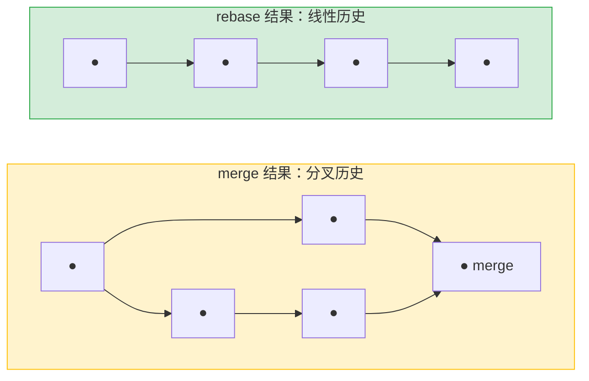

| 🎬 场景 | ⌨️ 命令 | 📝 说明 |
|:---|:---|:---|
| 把 feature 变基到 main | `git switch feature && git rebase main` | feature 上的提交搬到 main 最新位置 |
| 同步远程最新代码 | `git pull --rebase` | 拉取远程 + 把自己的提交 rebase 上去 |
| **交互式变基** | `git rebase -i HEAD~3` | 整理最近 3 次提交：合并、改消息、调顺序 |
| 放弃变基 | `git rebase --abort` | 回到变基前的干净状态 |
| 解决冲突后继续 | `git rebase --continue` | 改完冲突文件 → add → continue |

#### 交互式 rebase 指令表

```bash
# pick abc123 添加登录
# pick def456 修复登录bug    ← 这两个可以 squash 合并
# pick ghi789 WIP: 重构       ← 可以 reword 改消息
```

| 指令 | 作用 |
|:---|:---|
| `pick` | 保留这个提交（默认） |
| `reword` | 改提交消息 |
| `squash` | 合并到上一个提交，消息也合并 |
| `fixup` | 合并到上一个提交，丢弃本提交的消息 |
| `drop` | 删除这个提交 |
| `edit` | 暂停让你修改这个提交的内容 |
| `reorder` | 换行顺序 = 调换提交顺序 |

> ⚠️ **⚠️ rebase 的黄金法则：不要对已经 push 到公共仓库的提交做 rebase！**
>
> Rebase 会改写提交的 SHA，如果别人基于你的旧提交做了工作，rebase 后他们的基础就"悬空"了。只 rebase 你本地还没 push 的提交。

---

### 🎯 `git cherry-pick` — 遴选提交


**📐 公式**:
```bash
git cherry-pick <commit-sha>          # 把指定提交"复制"到当前分支
git cherry-pick <sha1>..<sha2>        # 复制一个范围（不含 sha1）
git cherry-pick <sha1>^..<sha2>       # 复制一个范围（含 sha1）
git cherry-pick --abort               # 放弃
```

**💡 一句话**: 只把某一次（或几次）提交的改动"搬"到当前分支，不合并整个分支。

| 🎬 场景 | ⌨️ 命令 | 📝 说明 |
|:---|:---|:---|
| 单次提交 | `git cherry-pick abc123` | 把 abc123 这个提交的改动应用到当前分支 |
| 范围复制 | `git cherry-pick abc123^..def456` | 从 abc123 到 def456（包含 abc123） |
| 不自动提交 | `git cherry-pick --no-commit abc123` | 把改动放到工作区，你审核后再提交 |

> 💡 经典场景：你在 develop 分支上修了一个 Bug，release 分支也需要这个修复，但不想把整个 develop 合并过来。`cherry-pick` 完美解决。

---

### 🎯 `git stash` — 暂存工作现场


**📐 公式**:
```bash
git stash                   # 暂存所有改动，工作区变干净
git stash push -m "描述"    # 带描述信息暂存
git stash pop               # 恢复最近一次 stash 并删除记录
git stash apply             # 恢复最近一次 stash 但保留记录（更安全）
git stash list              # 查看 stash 列表
git stash drop              # 删除最近一次 stash
git stash clear             # 清空所有 stash
git stash pop stash@{1}     # 恢复指定的 stash
```

**💡 一句话**: 手头工作做到一半，需要紧急切换到别的分支，又不能提交——`stash` 帮你把脏工作区"寄存"起来。

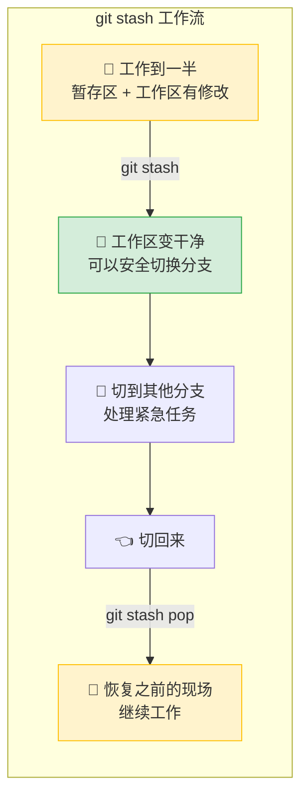

| 🎬 场景 | ⌨️ 命令 | 📝 说明 |
|:---|:---|:---|
| **紧急切换** | `git stash` | 把所有未提交改动藏起来 |
| 带说明暂存 | `git stash push -m "登录写到一半"` | 便于之后在 stash 列表里辨认 |
| **恢复并删除** | `git stash pop` | 最常用！恢复最近一次 stash 并从列表中删除 |
| **恢复但保留** | `git stash apply` | 恢复但不删除 stash 记录（可以应用到多个分支） |
| 查看暂存列表 | `git stash list` | `stash@{0}: WIP on feature: ...` |
| 删指定 stash | `git stash drop stash@{1}` | 删除 stash 列表里第 2 个 |
| 清空全部 | `git stash clear` | 🔴 清除所有 stash，不可恢复 |
| 连新文件一起暂存 | `git stash -u` | 默认 stash 不包含 untracked 文件，-u 包含 |
| 连 ignored 也暂存 | `git stash -a` | -u 的升级版，包含被 .gitignore 忽略的文件 |

> ⚠️ `git stash pop` 会**删除**该 stash 记录。如果恢复时遇到冲突，stash 不会被自动删除（安全机制），需要手动 `git stash drop`。更保守的做法是用 `git stash apply`。

---

## 6. ☁️ 远程协作篇

> 🟡 <span style="color:#bf8700">**安全等级：注意**</span> — 涉及与外部仓库交互，push --force 等操作需谨慎。

---

### 🎯 `git remote` — 远程仓库管理


**📐 公式**:
```bash
git remote -v                     # 查看所有远程仓库的 URL
git remote add <name> <url>       # 添加远程仓库
git remote remove <name>          # 移除远程仓库
git remote rename <old> <new>     # 重命名
git remote show <name>            # 查看某个远程的详细信息
git remote prune <name>           # 清理远程已删除分支的本地引用
```

**💡 一句话**: 管理"远程仓库"这个地址簿——告诉本地 Git 远程服务器在哪。

| 🎬 场景 | ⌨️ 命令 | 📝 说明 |
|:---|:---|:---|
| **查看远程地址** | `git remote -v` | 显示 fetch 和 push 的 URL |
| **关联远程仓库** | `git remote add origin https://github.com/user/repo.git` | origin 是约定俗成的名字 |
| 添加上游仓库 | `git remote add upstream <原仓库URL>` | Fork 工作流：origin 是你的 fork，upstream 是源仓库 |
| 修改 URL | `git remote set-url origin <新URL>` | 仓库搬家后更新地址 |
| 删除远程关联 | `git remote remove origin` | 解除关联 |
| 查看详情 | `git remote show origin` | 显示所有远程分支、跟踪关系 |
| 清理死分支引用 | `git remote prune origin` | 远程分支已删除但本地 `origin/xxx` 残留，用这个清理 |

---

### 🎯 `git fetch` — 获取远程更新


**📐 公式**:
```bash
git fetch                     # 从默认远程（origin）下载所有分支的更新
git fetch <remote>            # 从指定远程下载
git fetch <remote> <branch>   # 只下载指定分支
git fetch --prune             # 下载并清理远程已删除的分支引用
git fetch --all               # 从所有远程下载
```

**💡 一句话**: 去远程"看看有什么新东西"，下载到本地但不合并——只更新 `origin/main` 这样的远程跟踪分支。

| 🎬 场景 | ⌨️ 命令 | 📝 说明 |
|:---|:---|:---|
| 获取所有更新 | `git fetch` | 下载 origin 上所有分支的新提交 |
| 获取后看看有啥 | `git fetch && git log origin/main` | 看远程 main 多了什么 |
| 只取一个分支 | `git fetch origin main` | 只拉 main 分支的最新 |
| 清理死引用 | `git fetch --prune` | 同时删除远程已经不存在的分支引用 |

> 💡 **fetch vs pull**：`fetch` 是安全的"只看不摸"，`pull` = `fetch` + `merge`。推荐先用 `fetch` 看看远程有什么变化，再决定怎么合并。

---

### 🎯 `git pull` — 拉取并合并


**📐 公式**:
```bash
git pull                            # = fetch + merge（默认行为）
git pull --rebase                   # = fetch + rebase（推荐！）
git pull --ff-only                  # 只允许快进合并，否则报错（最安全）
git pull origin main                # 指定远程和分支
```

**💡 一句话**: 把远程更新拉下来并合并到本地当前分支。`fetch` + `merge/rebase` 的二合一操作。

| 🎬 场景 | ⌨️ 命令 | 📝 说明 |
|:---|:---|:---|
| 标准拉取 | `git pull` | 拉取跟踪分支的最新并合并 |
| **推荐：变基拉取** | `git pull --rebase` | 把你的本地提交 rebase 到远程最新提交之后，保持线性历史 |
| 全局设默认 rebase | `git config --global pull.rebase true` | 设完后 `git pull` 就等于 `git pull --rebase` |
| 最安全拉取 | `git pull --ff-only` | 只能在快进时合并，有分叉就报错让你手动处理 |

> 💡 **推荐做法**：
> ```bash
> git config --global pull.rebase true   # 全局设置 pull 默认用 rebase
> ```
> 这样每次 `git pull` 都是 `git pull --rebase`，保持历史整洁。

---

### 🎯 `git push` — 推送到远程


**📐 公式**:
```bash
git push                              # 推送当前分支到默认远程
git push -u origin <branch>           # 首次推送，建立跟踪关系
git push origin <branch>              # 推送到指定远程的指定分支
git push origin --delete <branch>     # 删除远程分支
git push origin <tag>                 # 推送一个标签
git push origin --tags                # 推送所有标签
git push --force                      # 🔴 强制推送（危险！）
git push --force-with-lease           # 🟡 更安全的强制推送
```

**💡 一句话**: 把本地仓库的提交"上传"到远程仓库，让团队其他人能看到。

| 🎬 场景 | ⌨️ 命令 | 📝 说明 |
|:---|:---|:---|
| **首次推送+关联** | `git push -u origin main` | `-u` 建立追踪，之后只需 `git push` |
| 日常推送 | `git push` | 推送当前分支到已关联的远程分支 |
| 推送指定分支 | `git push origin feature-x` | 把 feature-x 推送到远程 |
| **删除远程分支** | `git push origin --delete feature-x` | 远程的分支被删除 |
| 推送标签 | `git push origin v1.0.0` | 推送指定标签 |
| 推送所有标签 | `git push origin --tags` | 把所有本地标签推上去 |
| 强制推送（审慎） | `git push --force-with-lease` | 比 `--force` 安全：如果远程有新提交会拒绝推送 |
| 裸强制推送 | `git push --force` | 🔴 直接覆盖远程历史，队友会追着你打 |

> ⚠️ **`--force` vs `--force-with-lease`**：
> - `--force`：不管三七二十一，用你的历史覆盖远程 —— **非常危险**！
> - `--force-with-lease`：先检查远程有没有你不知道的新提交。如果有，拒绝覆盖 —— **相对安全**。
>
> 永远优先用 `--force-with-lease`。只在 100% 确定要覆盖时用 `--force`（比如你刚刚 `amend` 了自己还没人用的分支）。

---

## 7. 🔍 历史查看篇

> 🟢 <span style="color:#2da44e">**安全等级：安全**</span> — 全是只读操作，随便用。

---

### 🎯 `git log` — 查看提交历史


**📐 公式**:
```bash
git log                              # 查看提交历史（完整版）
git log --oneline                    # 一行一个提交（最实用）
git log --oneline --graph --all      # 图形化所有分支历史
git log --author="name"              # 按作者过滤
git log --since="2025-01-01"        # 按日期过滤
git log -- <file>                    # 只看某文件的提交历史
git log -p                           # 显示每次提交的详细 diff
git log --stat                       # 显示每次提交的文件统计
git log -n 5                         # 只看最近 5 条
git log --grep="关键词"              # 按提交消息搜索
git log -S "代码片段"                # 搜索引入/删除某段代码的提交
```

**💡 一句话**: Git 历史是时光机，`log` 是操作这台时光机的仪表盘。

#### 🔥 推荐组合：图形化历史

```bash
git log --oneline --graph --decorate --all
# 或者设置别名：
git config --global alias.lg "log --oneline --graph --decorate --all"
git lg   # 一行出图！
```

输出示例：
```
* a1b2c3d (HEAD -> feature, origin/feature) feat: add login
* e4f5g6h (origin/main, main) docs: update readme
* i7j8k9l Initial commit
```

| 🎬 场景 | ⌨️ 命令 | 📝 说明 |
|:---|:---|:---|
| **图形化全览** | `git log --oneline --graph --all` | 一张图看清所有分支的来龙去脉 |
| 看某人的提交 | `git log --author="张三"` | 支持模糊匹配 |
| 看今天的提交 | `git log --since="today"` | 也可以 `--since="2025-07-01"` |
| 看最近 N 条 | `git log -5` | 只看最近 5 条 |
| 看文件的修改历史 | `git log -p -- <file>` | 带 diff 的详细历史 |
| 看文件改了啥 | `git log --stat` | 统计每次提交改了多少行 |
| 搜索提交消息 | `git log --grep="bug"` | 在提交消息里搜关键词 |
| 搜索代码变更 | `git log -S "function login"` | 找出引入或删除 `function login` 的提交 |
| 两个分支的差异提交 | `git log main..feature` | feature 有但 main 没有的提交 |
| 自定义输出格式 | `git log --pretty=format:"%h - %an, %ar : %s"` | 完全自定义输出 |

#### 常用 `--pretty=format:` 占位符

| 占位符 | 含义 | 占位符 | 含义 |
|:---|:---|:---|:---|
| `%H` | 完整 commit SHA | `%an` | 作者名 |
| `%h` | 缩写 commit SHA | `%ae` | 作者邮箱 |
| `%s` | 提交标题 | `%ar` | 相对时间（3 days ago） |
| `%d` | 分支/标签引用 | `%ad` | 绝对日期 |

---

### 🎯 `git show` — 查看提交详情


**📐 公式**:
```bash
git show                    # 查看最新提交的详细信息
git show <commit-sha>       # 查看指定提交
git show --stat <sha>       # 只看文件统计
git show <sha>:<file>       # 看某个提交中某个文件的内容
```

| 🎬 场景 | ⌨️ 命令 | 📝 说明 |
|:---|:---|:---|
| 最新提交 | `git show` | 显示最新提交的消息 + diff |
| 指定提交 | `git show abc123` | 这个提交改了啥 |
| 看某文件的旧版本 | `git show HEAD~3:src/app.ts` | 3 次提交前 app.ts 长什么样 |

---

### 🎯 `git blame` — 逐行追溯


**📐 公式**:
```bash
git blame <file>              # 显示每一行是谁在哪个提交改的
git blame -L 10,20 <file>     # 只看第 10 到 20 行
git blame -L /pattern/ <file> # 从匹配 pattern 的行开始
```

**💡 一句话**: "这行代码是谁写的？什么时候？哪个提交？"——`blame` 全部告诉你。

| 🎬 场景 | ⌨️ 命令 | 📝 说明 |
|:---|:---|:---|
| 全文件追溯 | `git blame src/app.ts` | 每行显示 SHA、作者、时间 |
| 指定行范围 | `git blame -L 50,100 src/app.ts` | 只看第 50-100 行 |

> 💡 VS Code 用户：安装 **GitLens** 插件，每行代码末尾自动显示 blame 信息，无需手动打命令。

---

### 🎯 `git bisect` — 二分查找 Bug


**📐 公式**:
```bash
git bisect start                        # 开始二分查找
git bisect bad [<commit>]               # 标记当前（或指定）提交是有问题的
git bisect good [<commit>]              # 标记当前（或指定）提交是好的
git bisect reset                        # 结束二分查找，回到原位
# 自动化：
git bisect start HEAD <已知好的commit>
git bisect run <测试脚本>
```

**💡 一句话**: 已知某版本正常、某版本出 Bug，让 Git 用二分法帮你自动定位到引入 Bug 的那个提交。

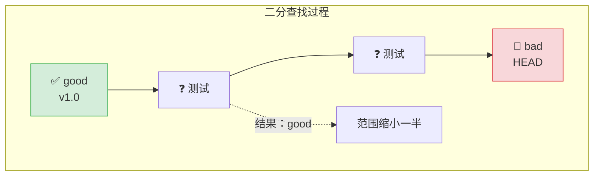

```bash
# 手动二分示例
git bisect start
git bisect bad HEAD          # 最新版本有问题
git bisect good v1.0.0       # v1.0.0 是好的
# Git 自动切到中间某个提交...
# 测试后告诉 Git：
git bisect good              # 或 git bisect bad
# 重复直到找到首个 bad 提交
git bisect reset             # 回到原来的分支
```

```bash
# 自动化二分示例
git bisect start HEAD v1.0.0
git bisect run npm test      # 用测试脚本自动判断好坏
git bisect reset
```

---

### 🎯 `git grep` — 搜索代码库


**📐 公式**:
```bash
git grep "pattern"                 # 在 Git 跟踪的文件中搜索
git grep -n "pattern"              # 显示行号
git grep -c "pattern"              # 只显示匹配数量
git grep "pattern" <commit>        # 在某个版本中搜索
```

**💡 一句话**: 比系统 `grep` 更快（只搜 Git 跟踪的文件，忽略 node_modules 等）。

| 🎬 场景 | ⌨️ 命令 | 📝 说明 |
|:---|:---|:---|
| 搜索代码 | `git grep "function login"` | 在所有跟踪文件中搜索 |
| 含行号 | `git grep -n "TODO"` | 列出所有 TODO 注释的位置 |
| 统计数量 | `git grep -c "import.*from"` | 每个文件各有多少行 import |
| 历史版本 | `git grep "oldFunc" v1.0.0` | v1.0.0 版本中有没有 oldFunc |

---

## 8. 🏷️ 标签管理篇

> 🟢 <span style="color:#2da44e">**安全等级：安全**</span> — 标签是只读锚点，标记发布版本。

---

### 🎯 `git tag` — 版本标签


**📐 公式**:
```bash
git tag                           # 列出所有标签
git tag <name>                    # 创建轻量标签（指向当前提交的指针）
git tag -a <name> -m "描述"      # 创建附注标签（含作者、日期、消息）
git tag -a <name> <commit> -m ""  # 给历史提交打标签
git push origin <tag-name>        # 推送一个标签
git push origin --tags            # 推送所有标签
git tag -d <name>                 # 删除本地标签
git push origin --delete <name>   # 删除远程标签
```

**💡 一句话**: 给某个提交贴一个永久标签，通常用来标记发布版本号（v1.0.0, v2.3.1）。

#### 轻量标签 vs 附注标签

| 类型 | 命令 | 特点 |
|:---|:---|:---|
| **轻量标签** | `git tag v1.0.0` | 只是一个指向提交的指针，不含额外信息 |
| **附注标签** | `git tag -a v1.0.0 -m "正式发布"` | Git 完整对象：含作者、日期、消息，可通过 `git show` 查看 |

> 💡 发布版本用**附注标签**（`-a`），临时标记用轻量标签。

| 🎬 场景 | ⌨️ 命令 | 📝 说明 |
|:---|:---|:---|
| 打轻量标签 | `git tag v1.0.0` | 在当前提交上打标签 |
| **打附注标签（推荐）** | `git tag -a v1.0.0 -m "首次正式发布"` | 含完整元信息 |
| 给历史提交打标签 | `git tag -a v0.9.0 abc123 -m "回溯标签"` | 给过去的提交补标签 |
| 推送指定标签 | `git push origin v1.0.0` | 标签默认不推送，需要显式推送 |
| 推送所有标签 | `git push origin --tags` | 把所有本地标签推上去 |
| 删除本地标签 | `git tag -d v1.0.0` | 删除本地标签 |
| 删除远程标签 | `git push origin --delete v1.0.0` | 删除远程标签 |

---

## 9. ↩️ 撤销与回退篇

> 🔴 <span style="color:#cf222e">**安全等级：危险**</span> — 有些操作不可逆，请仔细阅读每个警告。

---

### 🎯 `git reset` — 重置提交历史


**📐 公式**:
```bash
git reset --soft <commit>    # 重置 HEAD 到指定提交，保留暂存区和工作区
git reset --mixed <commit>   # 重置 HEAD 和暂存区，保留工作区（默认行为）
git reset --hard <commit>    # 🔴 重置一切：HEAD、暂存区、工作区全部覆盖
git reset HEAD~1             # 撤销最近一次提交（mixed 模式）
git reset <file>             # 取消暂存指定文件（= git restore --staged <file>）
```

**💡 一句话**: 让 HEAD 指针"回退"到某个历史提交，三种模式控制回退多少。

#### 三种 reset 模式对比

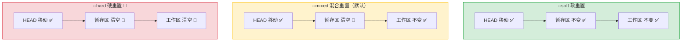

| 模式 | HEAD | 暂存区 | 工作区 | 使用场景 |
|:---|:---|:---|:---|:---|
| `--soft` | ✅ 移动 | ✅ 保留 | ✅ 保留 | 撤销 commit 但保留所有改动，方便重新提交 |
| `--mixed` (默认) | ✅ 移动 | 🔄 重置 | ✅ 保留 | 撤销 commit 和 add，改动回到工作区 |
| `--hard` | ✅ 移动 | 🔄 重置 | 🔴 **丢弃** | 彻底放弃所有改动，回到干净状态 |

| 🎬 场景 | ⌨️ 命令 | 📝 说明 |
|:---|:---|:---|
| **撤销最近提交（保留改动）** | `git reset --soft HEAD~1` | 提交没了，改动在暂存区，可以重新 commit |
| 撤销 commit + add | `git reset HEAD~1` | （等同于 --mixed）改动回到工作区 |
| **彻底放弃一切** | `git reset --hard HEAD` | 🔴 丢弃所有未提交的改动 |
| 回到 3 次提交前 | `git reset --hard HEAD~3` | 🔴 最近 3 次提交全部丢弃 |
| 取消暂存某文件 | `git reset <file>` | 等于 `git restore --staged <file>` |

> ⚠️ **救命的 `git reflog`**：即使 `git reset --hard` 把提交"弄丢了"，只要没执行 `git gc`，90 天内都可以通过 `reflog` 找回。详见下一节。

---

### 🎯 `git revert` — 安全回退


**📐 公式**:
```bash
git revert <commit-sha>       # 创建一个新提交来"反做"指定提交的改动
git revert HEAD               # 反做最近一次提交
git revert --no-commit <sha>  # 不自动提交，改动放到工作区
git revert --abort            # 放弃 revert
```

**💡 一句话**: "撤销但留记录"——创建一个新提交来抵消旧提交，历史不丢失。

> 💡 **reset vs revert 如何选择？**
> - 撤销的提交**只在本地**，没 push → 用 `reset`
> - 撤销的提交**已经 push** 到远程 → 用 `revert`（安全，不破坏公共历史）

| 🎬 场景 | ⌨️ 命令 | 📝 说明 |
|:---|:---|:---|
| 撤销最近一次提交 | `git revert HEAD` | 创建一个反向提交 |
| 撤销指定提交 | `git revert abc123` | 抵消 abc123 的改动 |
| 暂不提交 | `git revert --no-commit abc123` | 审核改动后再手动提交 |

---

### 🎯 `git reflog` — 引用日志（救命稻草）


**📐 公式**:
```bash
git reflog                     # 查看 HEAD 的移动历史
git reflog <branch>            # 查看某分支的移动历史
git reflog --all               # 查看所有引用
```

**💡 一句话**: 记录了你**本地仓库中 HEAD 和分支指针的每一次移动**——删掉的提交、reset 掉的改动，都能在这里找回来。

```
# 输出示例：
abc1234 HEAD@{0}: commit: feat: add login
def5678 HEAD@{1}: reset: moving to HEAD~1
ghi9012 HEAD@{2}: commit: WIP: 重构了一半（被 reset 掉了！）
```

| 🎬 场景 | ⌨️ 命令 | 📝 说明 |
|:---|:---|:---|
| 查看 HEAD 移动史 | `git reflog` | 看到所有"曾经指向过"的提交 |
| 找回被 reset 的提交 | `git reset --hard HEAD@{2}` | 回到 reflog 记录的某个状态 |
| 找回被删分支 | `git checkout -b recovered HEAD@{5}` | 基于 reflog 记录创建分支找回 |

> 💡 **典型急救流程**：
> ```bash
> git reflog                        # 找到被 reset 前的 HEAD@{n}
> git reset --hard HEAD@{3}         # 穿越回去！
> ```

---

### 🎯 `git clean` — 清理未跟踪文件


**📐 公式**:
```bash
git clean -n              # 预览：哪些未跟踪文件会被删除（安全，只显示不删）
git clean -f              # 删除未跟踪的文件
git clean -fd             # 删除未跟踪的文件 + 目录
git clean -fx             # 删除未跟踪的文件 + 被 .gitignore 忽略的文件
```

**💡 一句话**: 清除工作区中所有没被 Git 跟踪的文件和文件夹（编译产物、临时文件等）。

| 🎬 场景 | ⌨️ 命令 | 📝 说明 |
|:---|:---|:---|
| **先看看会删什么** | `git clean -n` | 🔍 预览模式，安全无害 |
| 删除未跟踪文件 | `git clean -f` | 删除未跟踪的文件（不含目录） |
| 含目录一起删 | `git clean -fd` | 删除文件 + 空目录 |
| 含 ignored 文件 | `git clean -fx` | 连 `node_modules/` 等被忽略的一起删 |

> ⚠️ **永远先用 `-n` 预览！**`git clean -fd` 删除的内容无法恢复（不经过 Git，不进回收站）。

---

## 10. 🚀 高级篇

> 🟣 <span style="color:#8250df">**安全等级：进阶**</span> — 不是每天用，但关键时刻能解决大问题。

---

### 🎯 `git submodule` — 子模块


**📐 公式**:
```bash
git submodule add <url> [path]         # 添加子模块
git submodule update --init --recursive # 初始化并更新所有子模块
git submodule update --remote          # 拉取子模块的最新提交
git clone --recurse-submodules <url>   # 克隆时一并初始化子模块
```

**💡 一句话**: 在一个 Git 仓库里嵌套另一个 Git 仓库——适合管理项目依赖的第三方库。

| 🎬 场景 | ⌨️ 命令 | 📝 说明 |
|:---|:---|:---|
| 添加子模块 | `git submodule add https://github.com/lib/theme.git libs/theme` | 在 libs/theme 里嵌入 theme 库 |
| 克隆含子模块的仓库 | `git clone --recurse-submodules <url>` | 一次性克隆主仓库+子模块 |
| 更新子模块 | `git submodule update --remote` | 拉取子模块的最新版本 |

---

### 🎯 `git worktree` — 多工作树


**📐 公式**:
```bash
git worktree add <path> <branch>    # 在另一个目录 checkout 一个分支
git worktree list                   # 列出所有工作树
git worktree remove <path>          # 删除工作树
git worktree prune                  # 清理已删除工作树的记录
```

**💡 一句话**: 同一个仓库，同时 checkout 多个分支到不同目录——不用来回切换就能并行工作。

```bash
# 场景：main 分支在跑测试，你想同时开发新功能
git worktree add ../project-hotfix hotfix    # 在隔壁目录 checkout hotfix 分支
cd ../project-hotfix                         # 过去开发，不影响原目录的测试
```

---

### 🎯 `git archive` / `git bundle`

**📐 公式**:
```bash
git archive --format=zip HEAD > project.zip    # 打包当前版本为 zip
git archive -o latest.tar.gz HEAD              # 打包为 tar.gz
git bundle create repo.bundle --all            # 创建完整仓库包（离线传输）
git clone repo.bundle                          # 从 bundle 克隆
```

| 🎬 场景 | ⌨️ 命令 | 📝 说明 |
|:---|:---|:---|
| 导出源码包 | `git archive -o v1.0.zip v1.0.0` | 发布不带 .git 的源代码包 |
| 离线传输仓库 | `git bundle create my.bundle --all` | 生成单个文件，U 盘拷走 |

---

## 11. 📋 实用工作流

### 11.1 日常开发流（单人/小团队）

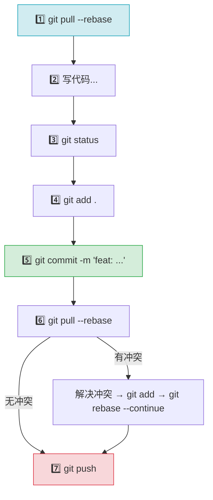

```bash
# 标准日常流程（每次开始写代码前）
git pull --rebase              # 同步远程最新
# ... 写代码 ...
git status                     # 看看改了啥
git add .                      # 暂存所有
git commit -m "feat: 描述"     # 提交
git pull --rebase              # 推送前再同步一次
git push                       # 推！
```

---

### 11.2 Feature 分支流

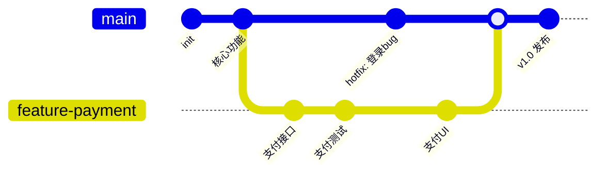

```bash
# 开新功能
git switch -c feature-payment          # 从 main 创建功能分支
# ... 开发，多次提交 ...
git add . && git commit -m "支付接入"

# 期间 main 有更新，同步过来
git switch main && git pull            # 先更新 main
git switch feature-payment             # 切回功能分支
git rebase main                        # 把功能分支 rebase 到最新 main

# 开发完毕，合并回 main
git switch main
git merge --no-ff feature-payment      # --no-ff 保留分支轨迹
git push origin main
git branch -d feature-payment          # 清理已合并的分支
```

---

### 11.3 紧急修复流（Hotfix）

```bash
# 正在 feature 分支上开发，突然要修线上 Bug
git stash push -m "支付写到一半"        # 1. 暂存当前工作
git switch main                         # 2. 切到 main
git pull                                # 3. 同步最新
git switch -c hotfix-critical-bug       # 4. 从 main 开修复分支
# ... 修 Bug ...
git add . && git commit -m "fix: 严重 Bug"
git switch main && git merge --no-ff hotfix-critical-bug
git push origin main                    # 5. 推送修复
git switch feature-payment              # 6. 回到功能分支
git rebase main                         # 7. 把修复同步过来
git stash pop                           # 8. 恢复之前的进度
```

---

### 11.4 合并 vs 变基选择指南

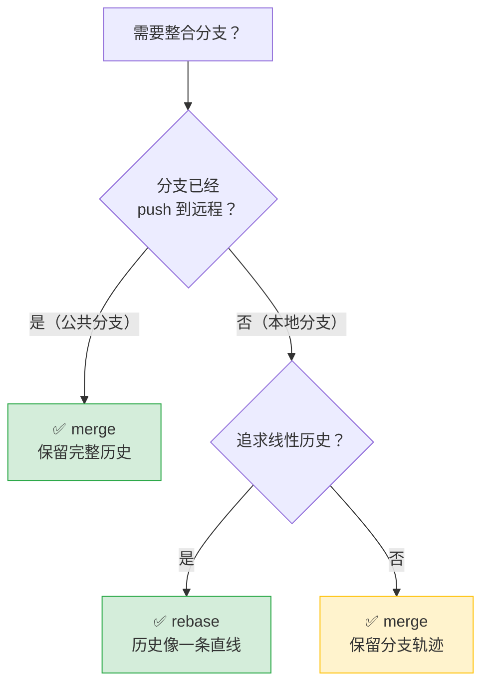

> 💡 **简单口诀**：公共分支用 merge，本地整理用 rebase。

---

## 附录 A：命令速查表

> 一页纸浓缩，按使用频率排序。打印出来贴在显示器旁边。

### 🔥 每天必用

| 命令 | 作用 |
|:---|:---|
| `git status` | 当前状态一览 |
| `git add .` | 暂存所有改动 |
| `git commit -m "..."` | 提交 |
| `git pull --rebase` | 拉取并变基 |
| `git push` | 推送 |
| `git log --oneline -10` | 看最近 10 条记录 |

### ⚡ 常用

| 命令 | 作用 |
|:---|:---|
| `git diff` | 工作区 vs 暂存区 |
| `git diff --staged` | 暂存区 vs HEAD |
| `git restore <file>` | 撤销工作区修改 |
| `git restore --staged <file>` | 取消暂存 |
| `git switch -c <name>` | 创建并切换分支 |
| `git stash` / `git stash pop` | 暂存工作 / 恢复 |
| `git merge <branch>` | 合并分支 |
| `git log --oneline --graph --all` | 图形化全历史 |
| `git branch -d <name>` | 删除已合并分支 |

### 🛠️ 偶尔用但很关键

| 命令 | 作用 |
|:---|:---|
| `git commit --amend` | 追加到上一次提交 |
| `git rebase -i HEAD~3` | 整理最近 3 次提交 |
| `git cherry-pick <sha>` | 复制一个提交 |
| `git reset --soft HEAD~1` | 撤销提交但保留改动 |
| `git revert <sha>` | 安全反做（已 push 的提交） |
| `git reflog` | 找回丢失的提交 |
| `git bisect start` | 二分定位 Bug |
| `git push --force-with-lease` | 安全强制推送 |

---

## 附录 B：推荐 Git 别名

把以下内容加入 `~/.gitconfig` 的 `[alias]` 段：

```bash
[alias]
    # 状态与日志
    st     = status
    sts    = status -sb
    lg     = log --oneline --graph --decorate --all
    lga    = log --oneline --graph --decorate --all --author=''
    lgs    = log --oneline --graph --decorate --all --simplify-by-decoration
    last   = log -1 HEAD
    hist   = log --pretty=format:\"%h %ad | %s%d [%an]\" --graph --date=short
    
    # 分支
    co     = checkout
    sw     = switch
    swc    = switch -c
    br     = branch
    bra    = branch -a
    del    = branch -d
    delF   = branch -D
    
    # 提交
    ci     = commit
    ca     = commit --amend
    can    = commit --amend --no-edit
    unstage = restore --staged .
    discard = restore .
    
    # 合并与变基
    mg     = merge --no-ff
    rb     = rebase
    rbi    = rebase -i
    rbc    = rebase --continue
    rba    = rebase --abort
    
    # 撤销
    undo   = reset --soft HEAD~1
    uncommit = reset --mixed HEAD~1
    redo   = reset --hard HEAD@{1}
    
    # 远程
    pf     = push --force-with-lease
    pl     = pull --rebase
    
    # 实用工具
    aliases = config --get-regexp alias
    today  = log --oneline --since=\"00:00:00\"
    contrib = shortlog -sn --no-merges
```

---

## 附录 C：常用术语中英对照

| 英文 | 中文 | 解释 |
|:---|:---|:---|
| Repository | 仓库 | Git 存储项目完整历史的地方 |
| Working Directory | 工作区 / 工作目录 | 你硬盘上的项目文件夹 |
| Staging Area / Index | 暂存区 / 索引 | 临时存放待提交改动的区域 |
| Commit | 提交 | 将暂存区的快照永久保存 |
| Branch | 分支 | 独立的开发线，平行的提交历史 |
| HEAD | HEAD 指针 | 指向当前所在分支的最新提交 |
| Merge | 合并 | 将两条分支的历史合并到一起 |
| Rebase | 变基 | 将提交"搬迁"到另一个基础上 |
| Fast-Forward | 快进合并 | 当目标分支没有新提交时，直接移动指针 |
| Conflict | 冲突 | 同一位置被不同分支修改，Git 无法自动合并 |
| Remote | 远程 | 托管在网络上的仓库副本 |
| Origin | 默认远程名 | 克隆时自动创建的远程名称 |
| Fetch | 获取 | 下载远程更新但不合并 |
| Pull | 拉取 | 下载远程更新并合并到本地 |
| Push | 推送 | 将本地提交上传到远程 |
| Tag | 标签 | 标记某个提交（常用作版本号） |
| SHA / Hash | 哈希值 | 每个 Git 对象的唯一标识（如 abc1234） |
| Detached HEAD | 分离头指针 | HEAD 指向具体提交而非分支 |
| Stash | 暂存（工作现场） | 临时保存工作区改动 |
| Cherry-Pick | 遴选 | 复制某个提交到当前分支 |
| Squash | 压缩 | 将多个提交合并为一个 |
| Amend | 修正 | 修改最近一次提交 |
| Fork | 复刻 | 将他人仓库复制到自己账户下 |
| Pull Request (PR) | 拉取请求 | 请求仓库维护者合并你的改动 |
| Clone | 克隆 | 将远程仓库完整下载到本地 |
| Bare Repository | 裸仓库 | 不含工作区的仓库（服务器上用） |
| Submodule | 子模块 | 嵌套在仓库中的另一个独立仓库 |

---

<p align="center">
  <br>
  
  <br><br>
  <sub>Made with ❤️ | 持续更新中 | 欢迎补充和纠错</sub>
</p>
